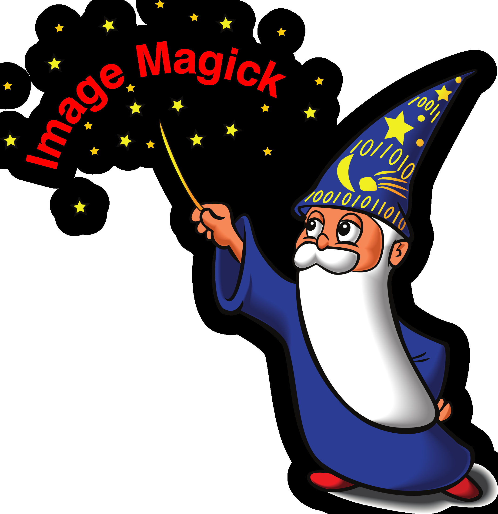
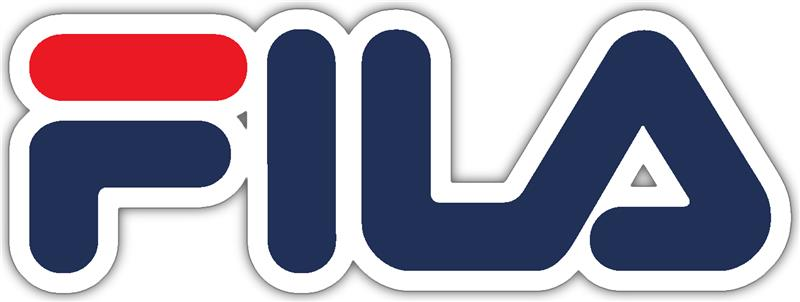

# Logo Sticker

This tool prepares logo images for sticker creation by generating a unified, filled alpha mask. It calculates the minimum dilation size needed to merge all separate parts of a transparent logo into one shape.

